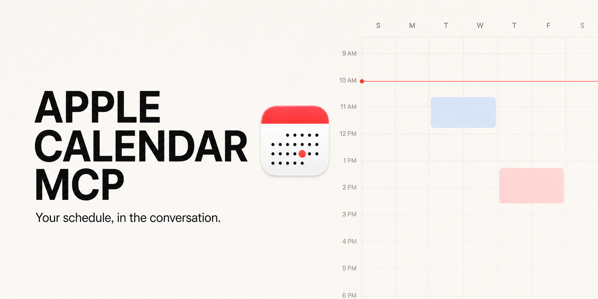
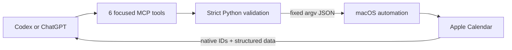

<p align="center">
  
</p>

<h1 align="center">Apple Calendar MCP</h1>

<p align="center"><strong>Your schedule, in the conversation.</strong></p>

<p align="center">
  <a href="https://github.com/henryvn27/apple-calendar-mcp/actions/workflows/ci.yml"></a>
  <a href="LICENSE"></a>
  
  
</p>

A small, local-first MCP plugin that lets Codex or ChatGPT work with the
Calendar app already on your Mac.

```text
You: What is on my calendar tomorrow?
AI: You have 4 events. Your first starts at 9:30 AM.

You: Find anything about the launch between September 1 and 15.
AI: Found 2 matching events across Work and Projects.

You: Add a project review Friday at 3 PM to Work.
AI: Added “Project review” to “Work”.
```

Read events, search a date range, add a meeting, change the details, or remove
an obsolete event. Calendar data stays in the native app; there is no cloud
database or dependency install.

## Install in Codex

```bash
codex plugin marketplace add henryvn27/apple-calendar-mcp
codex plugin add apple-calendar@apple-calendar-mcp
```

Start a new Codex task after installation. The first Calendar request may make
macOS ask whether Codex or Python can control Calendar. Choose **Allow**.

### Let an agent install it

Paste this into a Codex task:

```text
Install the Apple Calendar plugin from
https://github.com/henryvn27/apple-calendar-mcp on this Mac.

First inspect the configured plugin marketplaces and installed plugins. If an
Apple Calendar plugin is already enabled from another marketplace, stop and
explain the conflict. Do not install a duplicate or remove existing config.

Otherwise, run:
codex plugin marketplace add henryvn27/apple-calendar-mcp
codex plugin add apple-calendar@apple-calendar-mcp

Verify that apple-calendar@apple-calendar-mcp is installed and enabled. Then
tell me to start a new Codex task so the plugin loads. Remind me to choose Allow
if macOS asks whether Codex or Python can control Calendar. Do not create,
change, or delete a real event while verifying the installation.
```

Then ask naturally:

```text
List my calendars.
What is on my calendar tomorrow?
Find events with “launch” in the title or notes next week.
Show the details for the project review.
Add a 30-minute project review Friday at 3 PM to Work.
Move the review to 4 PM and add the conference room.
Remove the obsolete project review.
```

## What it can do

| Tool | What it does | Safety |
| --- | --- | --- |
| `list_calendars` | Lists native calendars, IDs, colors, and writability | Read-only |
| `search_events` | Searches an explicit date range; filters by text or exact calendar; paginates | Read-only |
| `get_event` | Reads one event and its attendees, alarms, recurrence, and metadata | Exact calendar and event IDs |
| `add_event` | Creates one timed or all-day event in an explicit calendar | One event; never guesses the calendar |
| `update_event` | Changes one event’s title, dates, notes, location, or URL | Exact IDs; recurring and invited events stay read-only |
| `delete_event` | Permanently deletes one event | Exact IDs; destructive; recurring and invited events stay read-only |

Calendar names are convenient for reads and adds, but duplicate names are
rejected. The IDs returned by `list_calendars`, `search_events`, and `get_event`
are the reliable targets for later actions.

Calendar’s scripting bridge can be slow on large libraries. Supplying a
`calendar_id` keeps the search to one calendar and is the fastest path; an
unscoped search still checks every available calendar.

There is no bulk delete, calendar delete, attendee writer, or recurring-series
writer. The plugin does not send invitation updates. Those limits are
deliberate: Calendar’s automation surface can turn a small edit into a series
or participant change.

All-day inputs use `YYYY-MM-DD`; the `end` date is inclusive. Timed inputs use
ISO 8601 with an explicit UTC offset, such as
`2026-09-04T15:00:00-04:00`. An update cannot switch an event between timed and
all-day.

## How it works



The server uses Python’s standard library and one fixed JavaScript for
Automation bridge. User content is serialized as JSON in a process argument; it
is not interpolated into shell commands or executable source.

## ChatGPT

ChatGPT does not connect directly to a local stdio MCP process. On supported
plans and workspaces, a custom MCP app can reach this server through OpenAI’s
Secure MCP Tunnel without opening an inbound public port. See the current
[developer mode and MCP app requirements](https://help.openai.com/en/articles/12584461-developer-mode-apps-and-full-mcp-connectors-in-chatgpt-beta).

When a remote client or tunnel is involved, Calendar data returned by a tool is
also visible to that client and tunnel. Local Codex use needs no API key and
adds no project-owned network service.

## Develop

```bash
cd plugins/apple-calendar
/usr/bin/python3 -m unittest discover -s tests -v
python3 -m py_compile server.py
osacompile -l JavaScript -o /tmp/apple-calendar.scpt calendar.js
```

Automated tests do not open Calendar or alter events. Live mutations happen
only through MCP `tools/call` requests.

## Security

Please report vulnerabilities through
[GitHub private vulnerability reporting](https://github.com/henryvn27/apple-calendar-mcp/security/advisories/new).
The trust boundary and mutation rules are documented in
[SECURITY.md](SECURITY.md).

## License

MIT © Henry Van Ness

Apple, Calendar, and macOS are trademarks of Apple Inc. This project is
independent and is not affiliated with or endorsed by Apple.
